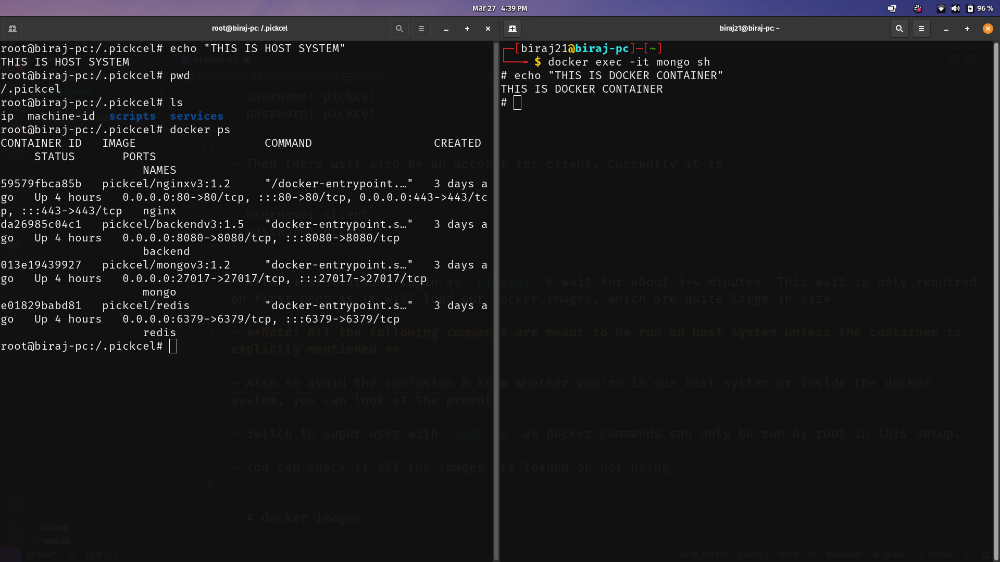
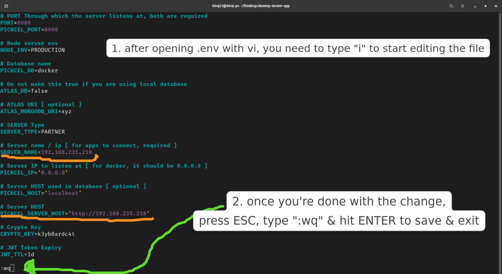

# docker-iso-setup

This is a custom ISO based on [Ubuntu Server 20.04](https://releases.ubuntu.com/focal/). This custom ISO will have our docker setup baked into it.

## Changes:

- **added redis container**
- **automatic restoration:** upon installation, our mongo data (dump files) which we were restoring manually will now be automatically restored
- **automatic server start:** on boot, our server will start automatically
- **automatic backup:** a cron job would be there which will take backup of our mongo databsae every day & will delete any backups that are 3 days or older
- **/.pickcel directory:** this directory will have our docker images, .env files, mongo-data, scripts & stuff. It's contents on first boot are:
  ```
  .env  application.json  docker-compose.yml  images  scripts  services
  ```
- **machine-id**: we are fetching system's base board's serial number & saving it in _/.pickcel/machine-id_ . It might be used to generate license key in the future.
- **ip**: we are using a script that will fetch local ip if available & store it in _/.pickcel/ip_. If the system is not connected to any network, it'll save _127.0.0.1_ in the file. This is a work in progess.

## TLDR:

- On first boot, wait for a few minutes for the docker images to be loaded & for the server to start.
- Then connect to a network, get local ip & set `SERVER_NAME` & `PICKCEL_SERVER_HOST` in _.env_ to that ip.
- Run `docker compose restart`.
- Done!

## Steps:

- Before installing, make sure that **secure boot is disabled** in your BIOS.

- Install this ISO in your system. All the steps are automated, which means that it will automatically choose keyboard keybord layout, time zone, etc & create a `sudo` account. this account will is meant for us, not for client. So it will have super user priviliges. Currenlty it is

  ```
  username: pickcel
  password: pickcel
  ```

- Then there will also be an account for client. Currently it is

  ```
  username: client
  password: client
  ```

- After installation, login as `pickcel` & wait for about 3-4 minutes. This wait is only required on first boot as it will load our Docker images, which are quite large in size.

- **Note: All the following commands are meant to be run on host system unless the container is explictly mentioned.**

- Also to avoid the confusion & know whether you're in our host system or inside the docker system, you can look at the prompt. First check out this image
  

  As you can see, host system's prompt (left half) will show current directory like

  ```
  root@biraj-pc:/.pickcel# pwd
  ```

  whereas inside docker (right half), it would just be

  ```
  # pwd
  ```

- Switch to super user with `sudo su` as docker commands can only be run by root in this setup.

- You can check if all the images are loaded on not using

  ```
  # docker images
  ```

- It should show 4 images:

  - pickcel/backendv3
  - pickcel/mongov3
  - pickcel/nginxv3
  - pickcel/redis

- Check if all of our containers are running using

  ```
  # docker ps
  ```

- This should display 4 processes (one for each of our images).

- Once this is done, our mongo data (dump files) which we were restoring manually will now be automatically restored. You can check this by

  ```
  # docker exec -it mongo sh
  ```

- After this, you'll be inside our mongo container. There you can use the `mongosh` command to check if our database (whose name is _docker_ in this case) exists or not.

  ```
  # mongosh  (inside the container)
  --- now we're in mongo shell inside our mongo container ---
  test> use docker  (switiching to our database for verification)
  docker> show collections
  ```

  If the restoration was successful, it would list the following collections

  ```
  advancedtags
  appprofiles
  appstores
  audits
  campaigns
  clocks
  compositionreports
  contentrepos
  contents
  entities
  groups
  languages
  licences
  onsitepartners
  partners
  plans
  playnows
  roles
  schedules
  screens
  screenshots
  stations
  tags
  users
  uuids
  ```

- Now exit `mongosh` & mongo container using `exit` command twice (one for mongosh & then one for our container)

  ```
  docker> exit
  # exit
  ```

- Now connect to a wifi network using

  ```
  # nmcli dev wifi connect <name> password <password>
  ```

- After connecting to wifi, get the local ip address using

  ```
  # ifconfig | grep "inet 192."
  ```

- This will give use the local ip which we will set in our _.env_ file. For this, we need to get into our backend container.

  ```
  # docker exec -it backend sh
  ```

- After getting in our backend container, edit the _.env_ using `vi` & set the following keys with the ip that we got.

  ```
  # vi .env  (inside our container)
  ```

- After opening _.env_ with `vi`, you need to type `i` to start editing the file.
- Then edit the following values

  ```
  SERVER_NAME=192.168....
  PICKCEL_SERVER_HOST='http://192.168....'
  ```

- Once you're done with the changes, press `ESC` type `:wq` & hit `ENTER` to save & exit

  

- Exit the container using `exit` command.

  ```
  # exit  (inside our container)
  ```

- Now you're back to your linux host when you have to exexute

  ```
  # cd /.pickcel
  # docker compose restart
  ```

- This will restart our server & we're ready to go.

To check out the scripts & services that are being used in the ISO, look at _scripts_ & _services_ directories in [this repo](https://github.com/biraj-pickcel/custom-iso-with-docker).
